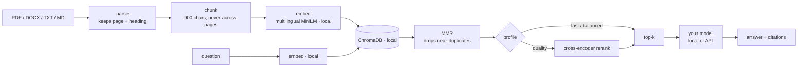

<div align="center">

# Glossa

**Ask your own documents. 35 languages. Every answer cites its source.**

[](https://github.com/Galactic717/glossa/actions/workflows/ci.yml)
[](LICENSE)
[](https://www.python.org/)
[](#privacy)

[Setup](docs/setup.md) · [Usage](docs/usage.md) · [API](docs/api.md) · [Contributing](CONTRIBUTING.md)

</div>

---

> *gloss* (n.) — a note in the margin that explains a passage and says where it came from.

Drop in a PDF, DOCX, TXT or Markdown file, ask a question in your language, get
an answer that cites the exact page it came from. Runs on a laptop with a local
model, or on any API you already pay for. One command starts everything.

```
> Коли треба сплатити за договором і яка пеня за прострочення?

За договором оплата здійснюється протягом 30 календарних днів з дати
підписання акта приймання-передачі [1]. Можливе відстрочення платежу
до 45 днів за письмовою згодою обох сторін [1]. За прострочення оплати
нараховується пеня у розмірі 0,1 відсотка за кожен день затримки [3].

  1  contract.pdf   p. 2    0.777
  2  contract.pdf   p. 1    0.664
  3  contract.pdf   p. 3    0.687

  ornith:9b · fast · 3 chunks · 64.1 s
```

A real run against [`examples/contract.pdf`](examples/contract.pdf), not a
mock-up. Reproduce it with `glossa add examples && glossa chat`.

## Quick start

```bash
ollama pull ornith:9b          # once, ~6 GB

git clone https://github.com/Galactic717/glossa
cd glossa
pip install -e .

glossa                         # builds the UI, serves it, opens the browser
```

That is the whole procedure. `glossa` with no arguments builds the web UI if it
has not been built, starts the API, and opens <http://localhost:8000>.

Prefer the terminal? `glossa add my.pdf` then `glossa chat`.

(If your shell cannot find `glossa`, Python's scripts directory is not on your
PATH — `python -m cli.main` does the same thing.)

No Ollama? Point Glossa at any API instead — see below, it is three lines.

## Bring your own model

Retrieval, embeddings and your documents always stay on your machine. Only the
question, the retrieved fragments and the answer go to whichever model you
choose — and with the default, nothing leaves at all.

| Provider | `GLOSSA_BASE_URL` | Example `GLOSSA_MODEL` | Key |
|---|---|---|---|
| **Ollama** (default) | `http://localhost:11434` | `ornith:9b` | — |
| OpenRouter | `https://openrouter.ai/api/v1` | `anthropic/claude-sonnet-5` | `sk-or-…` |
| Anthropic | `https://api.anthropic.com` | `claude-sonnet-5` | `sk-ant-…` |
| OpenAI | `https://api.openai.com/v1` | `gpt-4o-mini` | `sk-…` |
| Groq | `https://api.groq.com/openai/v1` | `llama-3.3-70b-versatile` | `gsk_…` |
| llama.cpp / LM Studio / vLLM | `http://localhost:8080/v1` | whatever it serves | — |

Switching is three lines in `.env`:

```bash
GLOSSA_BASE_URL=https://openrouter.ai/api/v1
GLOSSA_MODEL=anthropic/claude-sonnet-5
GLOSSA_API_KEY=sk-or-...
```

Glossa speaks three wire formats — Ollama, OpenAI-compatible and Anthropic —
and picks the right one from the URL. Override with `GLOSSA_PROVIDER` if you
front a provider with a proxy on a neutral hostname.

## Why this exists

Most local RAG projects are one of two things: a notebook that dies the moment
you close it, or a framework tutorial with forty dependencies and no answer to
"where did that sentence come from?". This one is a small, finished tool:

- **Citations are not decoration.** Every fragment keeps its page or heading
  through chunking, so `[1]` points at a real paragraph a human can go read.
- **35 languages, not 2.** Multilingual embeddings let an English question
  interrogate a Ukrainian contract and answer in English, citing the Ukrainian.
- **No orchestration framework.** Chroma, sentence-transformers and one HTTP
  call. The whole retrieval path fits in one readable file.
- **Offline by default.** One 120 MB embedding model is downloaded once. After
  that, with a local model, you can unplug the network.

## Privacy

Your documents are parsed, chunked, embedded and indexed entirely on your
machine. There is no telemetry and no analytics. With the default local model,
the only network request Glossa ever makes is the one-time embedding-model
download. Point it at a hosted provider and exactly one thing changes: the
question plus the retrieved fragments are sent to that provider to be answered.
`glossa dash` always shows which provider is active and whether it is local.

## Features

| | |
|---|---|
| **Formats** | PDF, DOCX, TXT, Markdown — with page and heading provenance |
| **Languages** | 35, including Ukrainian, Polish, German, Arabic, Japanese ([full list](#supported-languages)) |
| **Models** | Local Ollama, or OpenRouter / Anthropic / OpenAI / Groq / llama.cpp / LM Studio / vLLM |
| **Launch** | One command — `glossa` |
| **Interfaces** | Web dashboard, interactive CLI, one-shot CLI, JSON pipe mode, REST API |
| **Streaming** | Token-by-token over SSE; sources render before the first token |
| **Multi-document** | Query the whole library or narrow to a selection |
| **Export** | Any answer to Markdown or JSON, sources included |
| **Presets** | `fast` / `balanced` / `quality` — trade latency for recall |
| **Reasoning models** | ornith, qwen3, deepseek-r1, gpt-oss — thinking disabled so answers are never empty |
| **Deployment** | `pip install -e .`, or `docker compose up` |

## How it works



Three details that matter more than they look:

**Chunks never span two blocks.** A fragment belongs to exactly one page or one
heading, so a citation points at something a human can find. Chunkers that pack
across page boundaries produce references that are subtly wrong.

**Ukrainian and Russian are separated by script, not statistics.** Detectors
confuse them on short input. Exclusive letters (`і ї є ґ` against `ы э ъ ё`)
settle it deterministically before the statistical detector is consulted.

**The target language is named, not implied.** Every request states the answer
language explicitly, because small models drift to English when merely asked to
"reply in the same language".

## Speed and quality

| Preset | Fragments | Reranker | Cost |
|---|---|---|---|
| `fast` | 3 | no | baseline |
| `balanced` | 5 | no | slightly more context for the model to read |
| `quality` | 8 | yes | widest recall, +470 MB reranker on first use |

Retrieval is milliseconds; the wall clock is almost entirely the model
generating tokens. The transcript above took **64 s** with `ornith:9b` on a
6 GB GPU with CPU offload. A hosted API answers the same question in a few
seconds. Measure your own with `glossa ask "..." --profile fast` and read
`elapsed_ms`.

## The CLI

```bash
glossa                       # server + web UI + browser
glossa add ./documents       # index a file or a folder
glossa docs                  # what is indexed
glossa ask "Що це?"          # one question
glossa ask "Що це?" --json   # machine-readable
glossa chat                  # streaming REPL
glossa search "оплата"       # retrieval only, no model — debug relevance
glossa dash                  # status: provider, library, profile
```

Add `--api http://host:8000` to any command to drive a running server instead of
loading models into the CLI process.

## API

```bash
curl -X POST localhost:8000/api/documents -F "files=@contract.pdf"

curl -X POST localhost:8000/api/ask \
  -H 'Content-Type: application/json' \
  -d '{"question":"Які терміни оплати?"}'
```

Interactive docs at `/docs`, full reference in [docs/api.md](docs/api.md).

## Supported languages

`uk` Українська · `en` English · `pl` Polski · `de` Deutsch · `fr` Français ·
`es` Español · `pt` Português · `it` Italiano · `nl` Nederlands · `cs` Čeština ·
`sk` Slovenčina · `sl` Slovenščina · `hr` Hrvatski · `ro` Română ·
`bg` Български · `hu` Magyar · `el` Ελληνικά · `tr` Türkçe · `sv` Svenska ·
`da` Dansk · `no` Norsk · `fi` Suomi · `lt` Lietuvių · `lv` Latviešu ·
`et` Eesti · `he` עברית · `ar` العربية · `fa` فارسی · `hi` हिन्दी ·
`id` Bahasa Indonesia · `vi` Tiếng Việt · `th` ไทย · `ja` 日本語 · `ko` 한국어 ·
`zh` 中文

Russian is not supported. Documents and questions detected as Russian are
rejected. This is deliberate — see [CONTRIBUTING.md](CONTRIBUTING.md).

## Stack

Python 3.10+ · FastAPI · ChromaDB · sentence-transformers · pypdf ·
python-docx · Typer + Rich · React 18 + TypeScript + Vite

No LangChain. The retrieval pipeline is about 300 readable lines in
[`backend/app/rag.py`](backend/app/rag.py); wrapping that in a framework would
add dependencies without adding capability.

## Project layout

```
backend/app/    FastAPI service + RAG engine  (rag.py and llm.py are the interesting files)
cli/            Typer CLI, shares the engine in-process
frontend/       React + TypeScript dashboard
docs/           setup · usage · api
tests/          pytest, engine stubbed so CI needs no ML wheels
examples/       a sample contract and policy to try it on
```

## Roadmap

- [ ] OCR fallback for scanned PDFs
- [ ] Hybrid retrieval (BM25 + dense)
- [ ] Per-collection namespaces
- [ ] `.epub` and `.html` ingestion
- [ ] Conversation persistence across restarts

Issues and pull requests welcome. Read [CONTRIBUTING.md](CONTRIBUTING.md) first
— the dependency bar is high on purpose.

## License

MIT. See [LICENSE](LICENSE).
